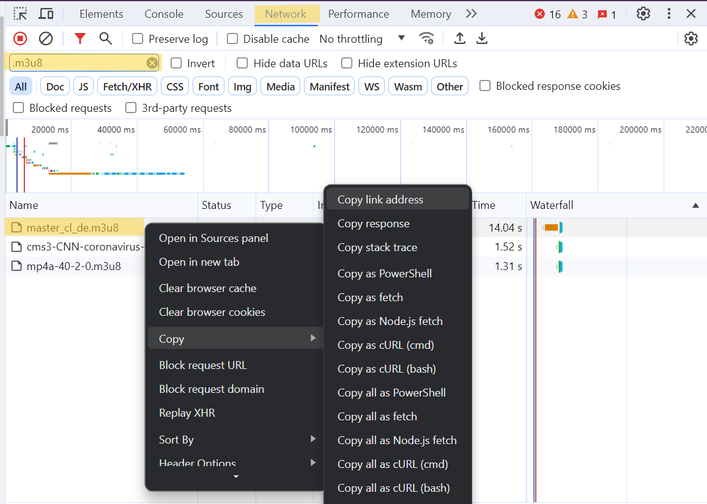

# About The Project

This project enable web scrapping for video that come with m3u8 file extension.

##### What is m3u8 file? ([More Info](http://https://www.lifewire.com/m3u8-file-2621956 "More Info"))
A file with the M3U8 file extension is a UTF-8 encoded playlist file. M3U8 files are plain text files that can be used to store the URL paths of streaming audio or video and information about the media tracks. (VIVE BUSINESS, 2023)

##### Expected Outcome of this Project
Able to extract and access the URL paths of streaming video (which will be a ts video file in multiple segments) to download the contents.

## Getting Started

Total of 3 main steps to web scrap a video with this repo.
1. Get the m3u8 master file link
1. Run the link with the script
1. Wait download to complete :)

### Prerequisites
- Setup environment
```
git clone <this repo via https or other means>
pip3 install -r requirements
```
- Get m3u8 master file
1. Open Developer Tools or Ctrl + Shift + I on your browser.
1. Search the video you would like to donwload and play it.
1. On Developer Tools open Network Tab.
1. Type ".m3u8" in the search bar.
1. Right click on the m3u8 master file and copy the link address.


## Usage
```
python3 main.py "<the link>" <name the file as you like> ./downloaded_video/
```
If successful you will the downloaded file in "downloaded_video" folder.


<!-- ROADMAP -->
## Roadmap
- [ ] Add Progress Bar
- [ ] Create a simple UI and executable program

See the [open issues](https://github.com/YapWC/scrap_m3u8_video/issues) for a full list of proposed features (and known issues).

<!-- CONTRIBUTING -->
## Contributing

Contributions are what make the open source community such an amazing place to learn, inspire, and create. Any contributions you make are **greatly appreciated**.

If you have a suggestion that would make this better, please fork the repo and create a pull request. You can also simply open an issue with the tag "enhancement".
Don't forget to give the project a star! Thanks again!

1. Fork the Project
2. Create your Feature Branch (`git checkout -b feature/AmazingFeature`)
3. Commit your Changes (`git commit -m 'Add some AmazingFeature'`)
4. Push to the Branch (`git push origin feature/AmazingFeature`)
5. Open a Pull Request

<p align="right">(<a href="#readme-top">back to top</a>)</p>


<!-- LICENSE -->
## License

Distributed under the MIT License. See `LICENSE.txt` for more information.

<p align="right">(<a href="#readme-top">back to top</a>)</p>

<!-- ACKNOWLEDGMENTS -->
## Acknowledgments

Thanks to:
1. [Coding Bunch](https://youtu.be/p07ZZZVL72E?si=_P3xWHkDrILKvaPf "Coding Bunch")
For the tutorial video on how to donwload ts video file via m3u8. Highly recommend others to watch, he explained the whole system very well!
1. [Globo.com](https://github.com/globocom/m3u8 "Globo.com")
For providing a great repo on loading m3u8 file format.

Thanks for making it free and a source for educational purpose.

<p align="right">(<a href="#readme-top">back to top</a>)</p>

##Disclaimer
This project does not suggest/recommend/encourage copyright infringement of anykind.
